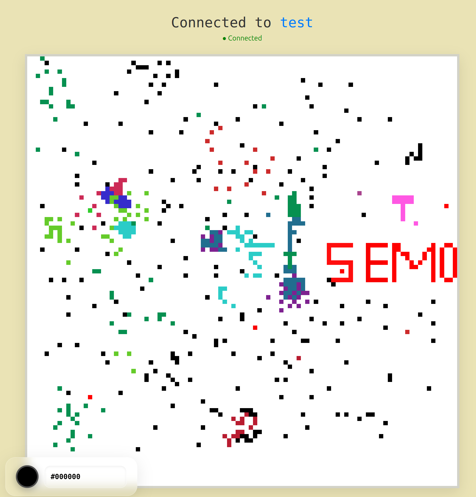
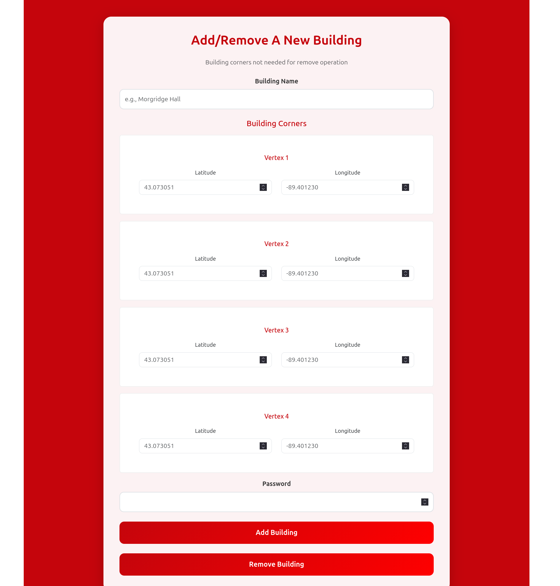
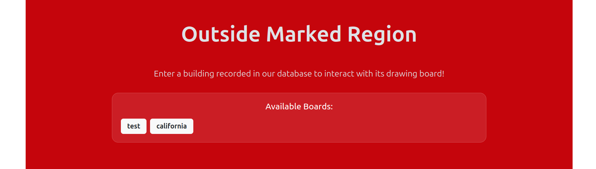

## Teck Stack 
Tech Stack

Frontend: React (or your framework) hosted on AWS S3 and distributed via CloudFront.

Backend: Node.js with TypeScript, running on AWS Fargate (ECS).

Database: SQLite persisted via AWS EFS (Elastic File System).

Real-time: WebSockets for low-latency pixel updates.

API: Express.js for initial state hydration.

## System Architecture

### Performance Optimization

To minimize latency for real-time pixel updates, the server maintains active board states and IDs in-memory rather than querying the database for every change. This ensures that the high-frequency WebSocket traffic remains fluid, while the SQLite database provides a persistent source (updated every 20 pixel updates) for boards incase the server goes down.

### Infrastructure & Security

Serverless Frontend: The frontend is decoupled from the API, hosted in an S3 bucket and cached globally via CloudFront for fast load times.

Containerized Backend: The Node.js environment is containerized and managed by an AWS Application Load Balancer (ALB) and Fargate, allowing for easy scaling (autoscalling is not yet implemeted).

Persistent Storage: By utilizing AWS EFS, the SQLite database remains persistent across container restarts and deployments.

### Images

