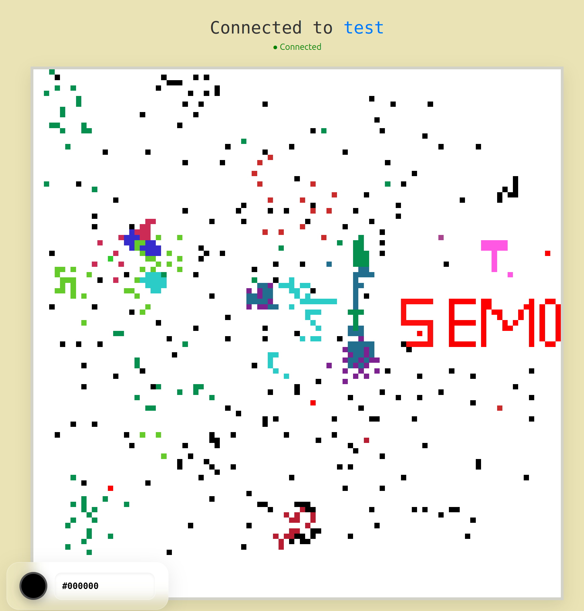
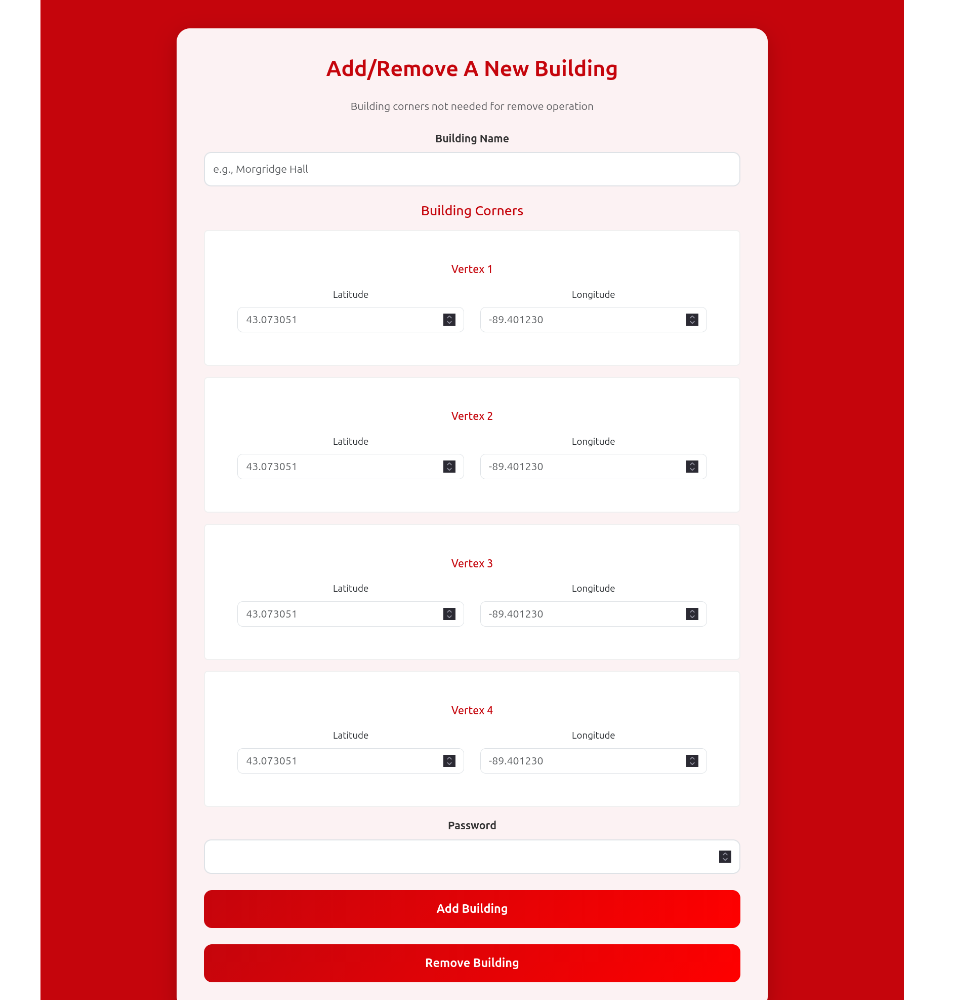
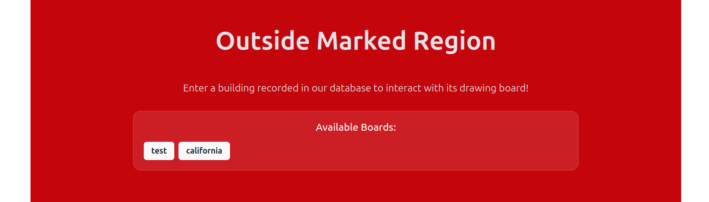

# Badger Board

A geographically enabled, real-time collaborative whiteboarding application. TypeScript end-to-end in a pnpm monorepo, backed by Redis, with real-time pixel updates over WebSockets.

## Tech Stack

- **Frontend:** React 19 + Vite, TypeScript, Tailwind CSS, shadcn/ui, TanStack Query, axios
- **Backend:** Node.js + TypeScript, Express, WebSockets (`ws`), zod validation
- **Data:** Redis (ioredis) — board state, pixel hash, and sessions
- **Infrastructure:** AWS (S3 + CloudFront for the frontend, ECS/Fargate for the API, ElastiCache for Redis) via AWS CDK
- **Tooling:** pnpm workspaces, oxlint, Prettier, vitest, commitlint, husky

## Repository Structure

```
apps/
  api/       Express REST + WebSocket API (controllers -> services -> redis)
  frontend/  React + Vite single-page app (components, hooks, features)
  infra/     AWS CDK stack (ElastiCache, ECS/Fargate, S3/CloudFront)
```

## Quickstart (local development)

### Prerequisites

- Node.js **20+** and **pnpm 9+** (`corepack enable` works if you have Node 20+)
- **Redis 7+** — either a local install, or Docker (recommended)

### Option A — Docker Compose (full stack, fastest)

Everything (Redis, API, frontend) runs in containers:

```bash
docker compose up --build
```

- Frontend: http://localhost
- API: http://localhost:8080/api
- WebSocket: ws://localhost:8080/ws
- Redis: localhost:6379

### Option B — Run natively with pnpm

Start a Redis first (Docker recommended):

```bash
docker run -d -p 6379:6379 redis:7-alpine
```

Install dependencies and start the API + frontend in watch mode:

```bash
pnpm install
pnpm dev
```

- Frontend (Vite dev server): http://localhost:5173 — `/api` and `/ws` are proxied to the API automatically
- API: http://localhost:8080

### Configuration

Environment variables are optional for local dev (sensible defaults are provided). Copy an example file to opt in:

```bash
cp apps/api/.env.example apps/api/.env
cp apps/frontend/.env.example apps/frontend/.env
```

| Variable              | Default                  | App      | Description                                                               |
| --------------------- | ------------------------ | -------- | ------------------------------------------------------------------------- |
| `PORT`                | `8080`                   | api      | HTTP port the API listens on                                              |
| `REDIS_URL`           | `redis://localhost:6379` | api      | Redis connection string                                                   |
| `ADMIN_KEY`           | _(empty)_                | api      | Authorizes admin endpoints (`x-admin-key` header); leave empty to disable |
| `FRONTEND_URL`        | `http://localhost`       | api      | CORS origin allowed for the browser frontend                              |
| `SESSION_TTL_SECONDS` | `600`                    | api      | Session TTL in seconds                                                    |
| `VITE_API_BASE_URL`   | `/api`                   | frontend | API base URL (use `/api` with the dev proxy)                              |

## Common Commands

Run from the repo root:

```bash
pnpm dev         # run API + frontend in watch mode
pnpm build       # build all apps
pnpm typecheck   # type-check all apps
pnpm lint        # lint all apps
pnpm test        # run all tests
pnpm format      # format with Prettier
```

Run a command for a single app with `pnpm --filter`:

```bash
pnpm --filter @badger/api test
pnpm --filter @badger/frontend build
```

## Architecture

The API exposes a small REST surface for listing/creating boards and sessions, and a single WebSocket endpoint (`/ws`) for real-time paint updates. Pixel writes are bounds-checked, persisted to a Redis hash, broadcast to subscribers over Redis Pub/Sub, and delivered to connected clients. Sessions map a geographic coordinate to a building polygon using point-in-polygon geolocation.

### Images





